# Healthcare Data Analytics Assignment

## * Executive Summary *

The healthcare data analysis revealed important patterns in patient admissions, hospital revenue, medical conditions, and medication usage. The hospital generated over ₦1.4 billion in total billing revenue, with chronic conditions such as Diabetes, Obesity, and Arthritis contributing significantly to overall financial performance. Patient admissions and billing trends also showed variations across months, insurance providers, and admission types.
The analysis further highlights the importance of efficient patient management, resource allocation, emergency care preparedness, and strategic partnerships with insurance providers to improve healthcare delivery and operational performance.

## * Key Insights & Interpretation *

### * Gender Distribution of Patients *

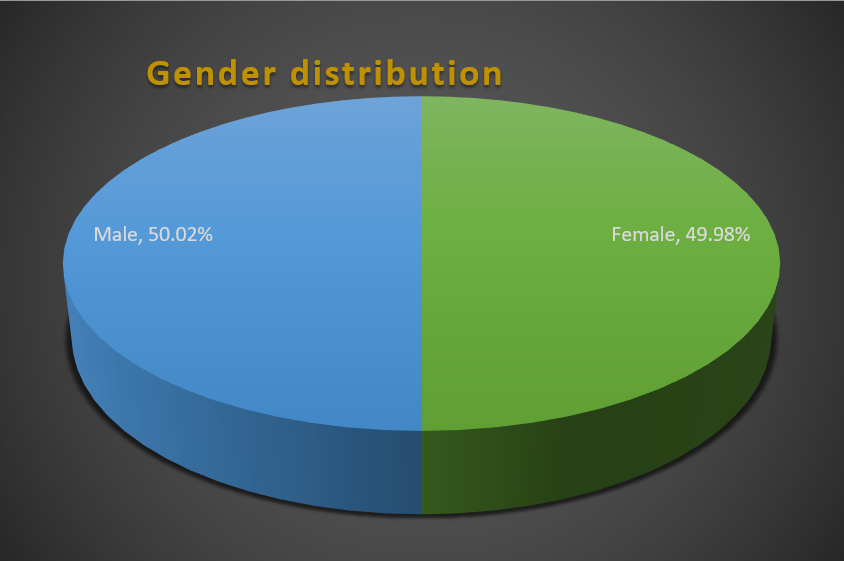

The patient population is almost equally distributed between male and female patients, indicating balanced healthcare utilization across genders. This suggests that hospital services and healthcare programs should continue to address both genders equally without major demographic bias.

### * Most Common Blood Group *

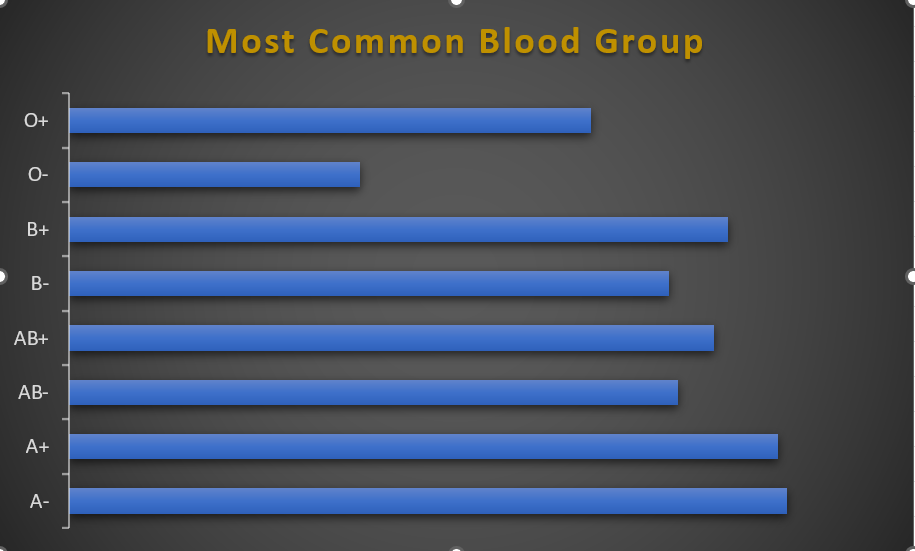

Blood groups A- and A+ appeared among the most common blood groups in the dataset. This insight can help the hospital improve blood bank inventory planning and emergency preparedness for transfusion-related services.

### * Most Common Medical Condition *

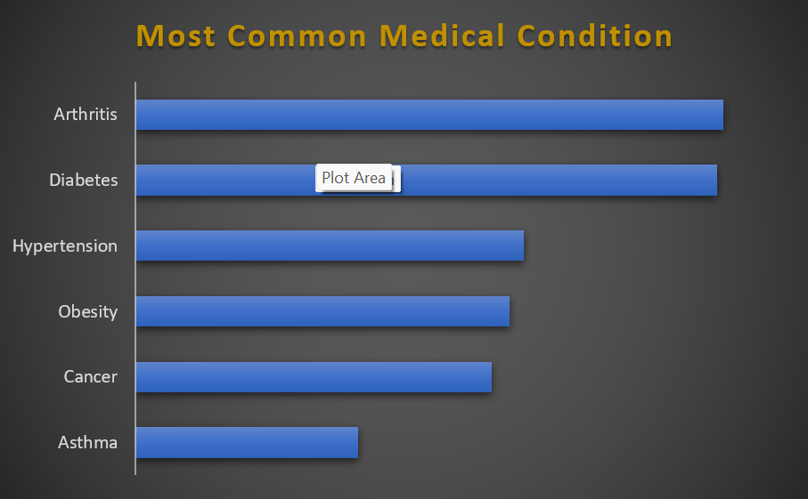

Diabetes and Arthritis recorded some of the highest patient counts among all medical conditions. This indicates a growing burden of chronic diseases and suggests the need for stronger long-term disease management and preventive healthcare programs.

### * Medical Condition with Highest Billing Amount *

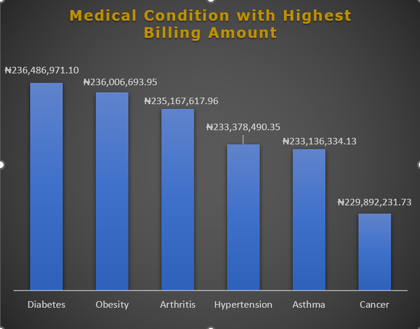

Diabetes generated the highest billing amount among all medical conditions, contributing significantly to hospital revenue. This may be due to prolonged treatment, medication costs, and repeated hospital visits associated with chronic disease management.

### * Total Hospital Revenue *

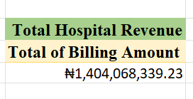

The hospital generated approximately ₦1.4 billion in total billing revenue, demonstrating strong financial performance and high patient activity across different departments and services.

### * Monthly Revenue Trend *

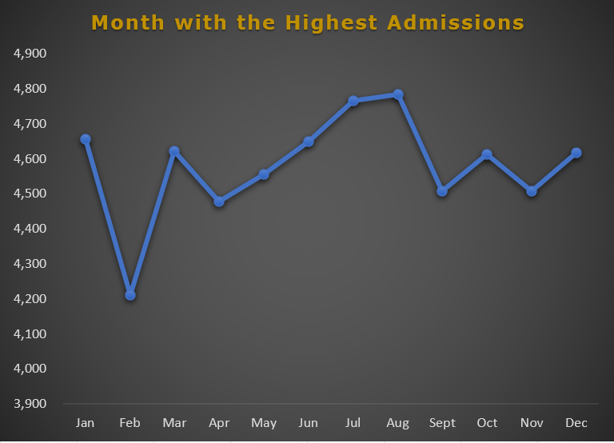

Revenue fluctuated across different months, with January recording one of the highest billing amounts. This suggests possible seasonal increases in hospital admissions and healthcare demand during certain periods of the year.

### * Insurance Provider Contribution *
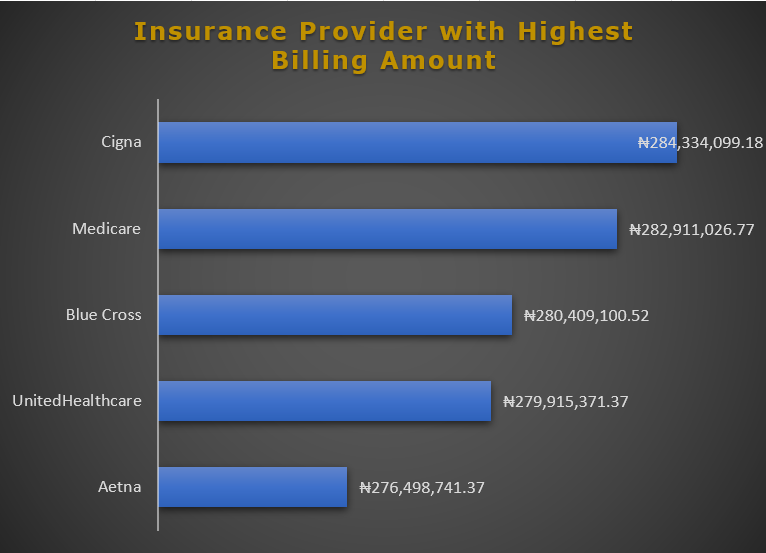

Medicare contributed the highest billing amount among insurance providers, making it one of the hospital’s most financially important healthcare partners. Maintaining strong partnerships with major insurance providers can improve financial sustainability.

### * Most Common Admission Type *

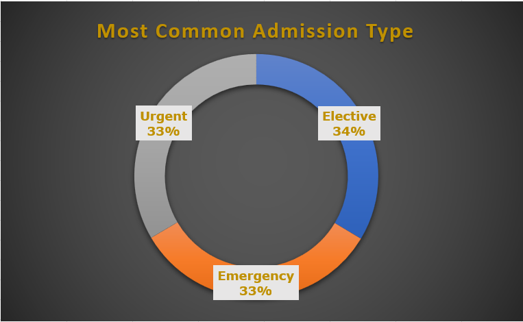

Elective admissions recorded the highest number of admissions, slightly above Urgent and Emergency admissions. This suggests that planned medical procedures and scheduled treatments form a major part of hospital operations.

### * Condition with Longest Hospital Stay *

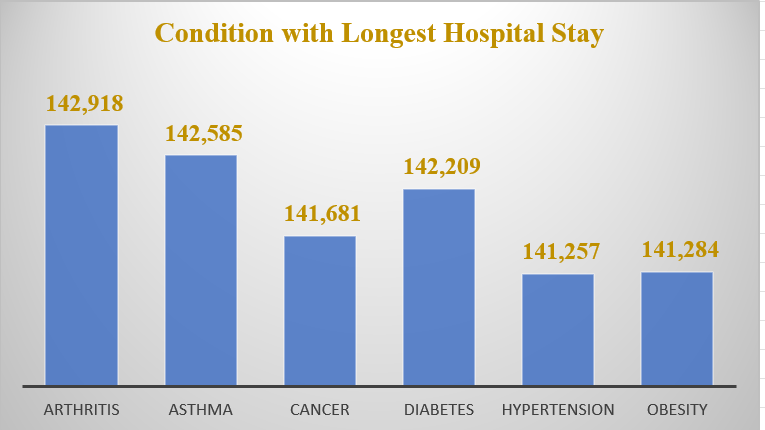

Arthritis patients recorded the longest cumulative hospital stay among the analyzed conditions. This may indicate prolonged treatment duration, rehabilitation requirements, or complications associated with chronic musculoskeletal disorders.

### * Medication Usage & Billing *

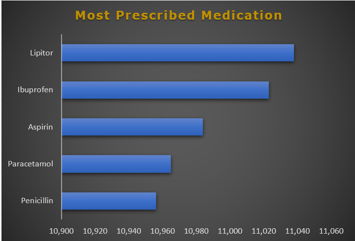 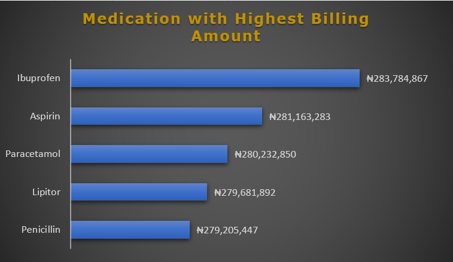

Frequently prescribed medications were associated with high billing amounts, showing the financial impact of pharmaceutical services within the hospital system. Proper medication inventory management is therefore essential to avoid shortages and improve patient care efficiency.

## * Recommendations *

- Increase investment in chronic disease management programs, especially for Diabetes and Arthritis patients.
- Improve collaboration with major insurance providers such as Medicare to maintain stable revenue flow.
- Enhance emergency preparedness and resource allocation despite elective admissions being slightly higher.
- Optimize medication inventory management for frequently prescribed drugs to prevent supply shortages.
- Monitor monthly revenue patterns to improve hospital budgeting and staffing decisions.
- Develop patient discharge optimization strategies to reduce prolonged hospital stays where possible.

## * Conclusion *

The healthcare analytics project provided valuable insights into hospital operations, patient behavior, financial performance, and treatment trends. Through the use of Pivot Tables and Pivot Charts, meaningful healthcare patterns were identified that can support management decision-making, operational planning, and improved patient care delivery.